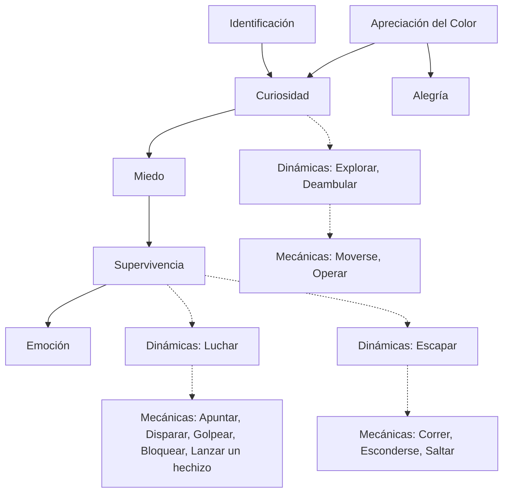
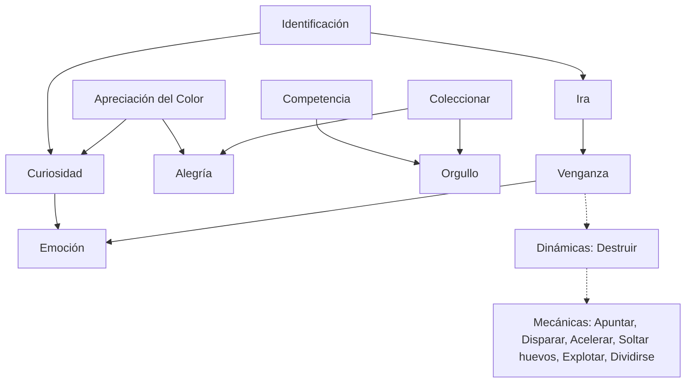
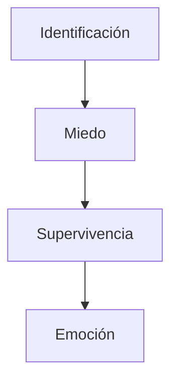
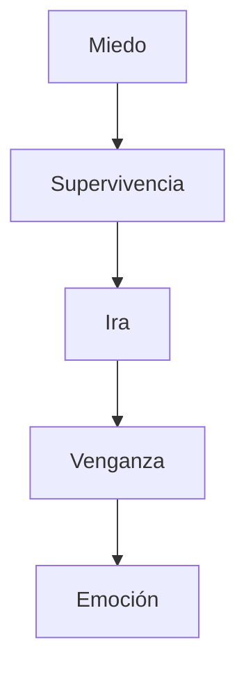

# EL FRAMEWORK 6-11: UNA NUEVA METODOLOGÍA PARA EL ANÁLISIS Y DISEÑO DE JUEGOS

> Traducción al español del artículo *"The 6-11 Framework: A New Methodology for Game Analysis and Design"*.
> Fuente original: [THE_6-11_FRAMEWORK_A_NEW_METHODOLOGY_FOR.pdf](pdfs/THE_6-11_FRAMEWORK_A_NEW_METHODOLOGY_FOR.pdf) (documento de 5 páginas, generado el 25 de enero de 2011).
> Los diagramas de las Figuras 1 a 4 se reconstruyeron a partir del PDF como bloques `mermaid`; los nombres de emociones, instintos, dinámicas y mecánicas se mantienen fieles al original.

**Roberto Dillon**
DigiPen Institute of Technology, Singapur
10 Central Exchange Green #01-01
Singapur 138649
Email: rdillon@digipen.edu

---

## PALABRAS CLAVE

Metodología de desarrollo de juegos, Diseño de juegos y métodos de investigación, Evaluación de la experiencia de juego (*gameplay experience*).

## RESUMEN

Este artículo describe el "Framework 6-11", una nueva metodología de análisis y diseño de juegos definida para ayudar a los diseñadores de juegos en el proceso de crear experiencias emocionalmente atrapantes y, en última instancia, "divertidas". El framework se contextualiza dentro de un modelo existente y bien conocido, el MDA, y luego se explica mediante ejemplos relevantes y casos de estudio.

## INTRODUCCIÓN

Ser capaz de capturar rápidamente la esencia de un juego y entender qué lo hace "divertido" es una habilidad necesaria para cualquier diseñador de juegos. Desafortunadamente, debido a la naturaleza subjetiva de la diversión en sí misma, demasiados análisis propuestos hasta ahora tienden a ser también bastante subjetivos o a ser aplicables solo en casos específicos. Entre los distintos enfoques y modelos que se han propuesto para explicar por qué los juegos pueden ser tan inmersivos y atrapantes, el modelo MDA (Hunicke et al. 2004) es el más conocido y se usa ampliamente tanto en la industria del videojuego como en el ámbito académico para analizar y formalizar ideas de juegos en distintos niveles de abstracción. El MDA se basa en los conceptos de Mecánicas, Dinámicas y Estéticas, definidos de la siguiente manera:

- **Mecánicas (Mechanics):** las reglas del juego, es decir, las acciones básicas y atómicas que los jugadores pueden realizar para jugar el juego.
- **Dinámicas (Dynamics):** el *gameplay*, es decir, las acciones complejas que se desarrollan como resultado de aplicar las mecánicas.
- **Estéticas (Aesthetics):** la respuesta emocional evocada en el jugador, que en última instancia conduce a una experiencia "divertida".

Las "Estéticas" son el aspecto más desafiante de analizar, ya que pueden ser extremadamente variables y personales. El modelo MDA enfrenta este problema proponiendo los "8 Tipos de Diversión" (*8 Kinds of Fun*), una taxonomía introducida para explicar distintos tipos de "diversión" relacionándolos con experiencias como la resolución de problemas ("Diversión como Desafío") o el juego de roles ("Diversión como Fantasía").

Esta clasificación, aunque perspicaz y fascinante, proporciona solo una descripción de muy alto nivel de lo que está ocurriendo dentro de la mente de los jugadores a nivel emocional. Al final, puede no ser muy directo relacionar un "tipo de diversión" particular con una dinámica específica dentro del juego, especialmente para diseñadores de juegos principiantes y estudiantes.

El "Framework 6-11" (Dillon 2010) intenta abordar estos problemas proporcionando una nueva taxonomía para las estéticas de los juegos que debería ser fácil de relacionar con las dinámicas reales del juego. Este proceso debería dar como resultado una imagen más clara y fácil de entender de por qué un juego es "divertido" y de cómo se desarrolla la experiencia emocional de los jugadores a lo largo del juego.

## EL FRAMEWORK 6-11

El Framework 6-11 propone que los juegos pueden ser tan atrapantes a nivel subconsciente porque se apoyan con éxito en un subconjunto de emociones e instintos básicos que son comunes y están profundamente arraigados en todos nosotros.

Específicamente, el framework se centra en seis emociones y once instintos que son recurrentes en psicología y que han sido ampliamente analizados en varios tratados muy conocidos (Izard 1977; Plutchik 1980; Weiner y Graham 1984; Ekman 1999).

### Las seis emociones

En particular, las seis emociones son:

- **Miedo (Fear):** una de las emociones más comunes en los juegos de hoy en día. Gracias a las tecnologías más nuevas, ahora es posible representar entornos y situaciones realistas donde el miedo puede desencadenarse fácilmente: piénsese en todos los juegos recientes de *survival horror* o en las exploraciones de mazmorras en juegos de rol (RPG) para encontrar abundantes ejemplos.

- **Ira (Anger):** una emoción poderosa que suele usarse como factor motivacional para volver a jugar o para avanzar en la historia con el fin de corregir los males que algún villano cometió.

- **Alegría / Felicidad (Joy / Happiness):** posiblemente, una de las emociones más relevantes para tener una experiencia de juego divertida. Por lo general es consecuencia de que el jugador tenga éxito en alguna tarea y sea recompensado por medio de *power-ups*, avances en la historia, etcétera.

- **Orgullo (Pride):** recompensar a los jugadores y hacerlos sentir bien por sus logros es un factor motivacional importante para empujarlos a mejorar aún más y avanzar en el juego para enfrentar desafíos todavía más difíciles.

- **Tristeza (Sadness):** a pesar de ser una emoción que no parece encajar con el concepto de "diversión", los diseñadores de juegos siempre se han sentido atraídos por ella como una manera de alcanzar nuevas alturas artísticas y tocar temas más complejos y maduros.

- **Emoción / Entusiasmo (Excitement):** la mayoría de los juegos que valen la pena deberían lograrla, y debería surgir naturalmente como consecuencia de haber desencadenado con éxito otras emociones y/o instintos.

### Los once instintos

Mientras que los once instintos centrales que se toman en consideración son:

- **Supervivencia (Lucha o Huida) (Survival — Fight or Flight):** el más fundamental y primordial de todos los instintos, que se desencadena cuando nosotros, como cualquier otro ser vivo, nos enfrentamos a una amenaza para la vida. Según la situación, nuestro cerebro decidirá al instante si debemos enfrentar la amenaza y luchar por nuestra vida o intentar evitarla encontrando una posible vía de escape. Esto se usa ampliamente en muchos videojuegos modernos.

- **Autoidentificación (Self Identification):** las personas tienden a admirar a los individuos exitosos o a los personajes de ficción inteligentes, y de manera natural empiezan a imaginarse siendo como sus modelos.

- **Coleccionar (Collecting):** un instinto muy fuerte que puede vincularse con una variedad de emociones distintas y que siempre se ha usado ampliamente en los juegos.

- **Codicia (Greed):** a menudo somos propensos a ir más allá de una simple "colección" y empezar a acumular mucho más de lo que realmente se necesita, solo por el hecho de hacerlo. Ya sea que hablemos de objetos realmente valiosos o simplemente de bienes y recursos que necesitamos para construir nuestro imperio virtual en un juego de estrategia, es probable que un instinto codicioso aflore muy temprano en nuestros hábitos de juego.

- **Protección / Cuidado / Crianza (Protection / Care / Nurture):** posiblemente el "mejor" instinto de todos: el que empuja a cada padre y madre a amar a sus hijos y a cada persona a sentir el impulso de cuidar y ayudar a quienes lo necesitan.

- **Agresividad (Aggressiveness):** la otra cara de la moneda, que suele conducir a la violencia cuando se combina con la codicia o la ira. Se explota en incontables juegos.

- **Venganza (Revenge):** otro instinto poderoso que puede actuar como fuerza motivacional y que a menudo se usa en los juegos para hacer avanzar la trama o justificar por qué necesitamos aniquilar a algún villano.

- **Competencia (Competition):** profundamente ligada a los aspectos sociales de nuestra psique y uno de los instintos más importantes en relación con el juego, por ejemplo, las tablas de clasificación (*leaderboards*). Sin ella, los juegos perderían gran parte de su atractivo.

- **Comunicación (Communication):** la necesidad de expresar ideas, pensamientos o simplemente chismes fue una de las más influyentes para la evolución humana, y también puede usarse con gran efecto en los juegos, ya sea al buscar información hablando con un personaje no jugable (NPC) o al compartir experiencias con otros jugadores en salas de chat y foros.

- **Exploración / Curiosidad (Exploration / Curiosity):** todos los descubrimientos humanos, ya sean de naturaleza científica o geográfica, se han hecho gracias a estos instintos que siempre nos empujaron hacia lo desconocido.

- **Apreciación del Color (Color Appreciation):** las escenas y entornos llenos de colores vibrantes nos atraen naturalmente, incluyendo los gráficos cada vez más detallados y coloridos que vemos en los juegos modernos.

### La idea principal

La idea principal detrás del Framework 6-11 es que estas emociones e instintos interactúan entre sí para construir una red o secuencia que debería terminar en "Alegría" y/o "Emoción", de modo de proporcionar a los jugadores una experiencia significativa y divertida. Esta red puede luego relacionarse con las dinámicas del juego al darse cuenta de que, cuando el juego despierta naturalmente distintas emociones en el jugador, estas desencadenarán distintos instintos. Estos instintos, a su vez, forzarán al jugador a actuar dentro del juego, mostrando en última instancia cómo el conjunto de las estéticas puede vincularse con el *gameplay* real y con las mecánicas del juego.

## EJEMPLOS

Para comprender mejor las posibles interacciones entre emociones e instintos que podemos describir usando este modelo, imaginemos que estamos diseñando un hipotético juego de acción/aventura en primera persona donde comenzamos sumergiendo al jugador en un entorno hermoso y colorido.

El exuberante entorno resonará naturalmente con nuestro instinto de "apreciación del color", dándole al jugador una sensación de bienestar y un sentimiento temprano de satisfacción/alegría. Esto, junto con el instinto de "autoidentificación" que estimulamos mediante una perspectiva en primera persona adecuada y, posiblemente, una historia de fondo convincente, también ayudará a desencadenar la "curiosidad" del jugador, la cual, a su vez, lo impulsará a explorar los alrededores. Una vez que esto ocurre, un estado emocional de "miedo" puede inducirse fácilmente mediante un encuentro repentino con una criatura hostil, desencadenando los instintos de "supervivencia" con la consiguiente "emoción" por la batalla y confrontación que siguen.

Toda la experiencia de juego, y la secuencia correspondiente de emociones e instintos, puede representarse mediante un diagrama, mostrado en la Figura 1, donde vemos cómo emociones específicas conducen a instintos que, a su vez, empujan al jugador a actuar dentro del juego por medio de las dinámicas del juego, que a su vez se hacen posibles a través de mecánicas particulares. Por ejemplo, aquí, nuestra curiosidad nos hará explorar el entorno, caminar por ahí y eventualmente resolver algún acertijo ambiental abriendo/desbloqueando pasajes ocultos, y luego, una vez que se ha planteado el encuentro peligroso, será nuestro instinto de supervivencia el que dirija naturalmente nuestras acciones, por ejemplo luchando contra el monstruo o intentando escapar hacia una zona segura. De cualquier manera, la experiencia resultante y la descarga de adrenalina sin duda traerán emoción y, en última instancia, brindarán una experiencia divertida a nuestro valiente aventurero.

*Figura 1: un diagrama que representa un análisis para un hipotético juego de acción y aventura. La Curiosidad y la Supervivencia son los instintos principales responsables de identificar las estéticas del juego y son los principales factores emocionales que impulsan el gameplay.*

> Detalle de la figura original: las flechas continuas conectan emociones e instintos (Identificación → Curiosidad; Apreciación del Color → Curiosidad y → Alegría; Curiosidad → Miedo → Supervivencia → Emoción). Las flechas punteadas conectan los instintos con las cajas de **Dinámicas** (*Exploring, Roaming* / *Fighting* / *Escaping*) y estas con las cajas de **Mecánicas** (*Moving, Operating* / *Aiming, Shooting, Striking, Blocking, Casting a spell* / *Running, Hiding, Jumping*).

Ahora podemos intentar analizar un juego comercial, como el premiado juego para móviles "Angry Birds" (Rovio 2009), para ver el framework en acción sobre un juego real, muy conocido y superventas.

En Angry Birds el jugador tiene la tarea de guiar a una familia de pájaros en su venganza contra un grupo de cerdos que les robaron los huevos. Una cinemática bien elaborada da inicio al juego proporcionando una historia de fondo muy simple pero atrapante para hacer que el jugador simpatice y se identifique con los pájaros. Esto también alimenta la ira hacia los cerdos, motivando un sentimiento de venganza que de hecho impulsará toda la experiencia de juego a través de una dinámica cuidadosamente diseñada de destruir las fortificaciones de los cerdos gracias a las habilidades únicas de cada pájaro (las cuales identificarán las mecánicas individuales del juego).

Pero hay más para analizar si queremos entender completamente qué hace que este juego sea tan cautivador y atrapante.

Además de los gráficos muy coloridos, que ayudarán a aumentar la curiosidad del jugador por ver la siguiente escena y progresar en la sencilla trama, la posibilidad de registrar nuestros puntajes, tanto en tablas de clasificación locales como mundiales, añade un elemento competitivo muy fuerte que hará que los jugadores se sientan orgullosos de sus logros y resultados. Este orgullo también se verá enormemente reforzado por la posibilidad de coleccionar distintos objetos de bonificación, como huevos dorados y estrellas, que elevarán el puntaje general y mantendrán a los jugadores interesados durante mucho tiempo.

Usando el framework 6-11, todo esto puede resumirse fácil y concisamente en un diagrama como el de la Figura 2.

*Figura 2: un diagrama que describe el juego "Angry Birds" de Rovio. Varios instintos distintos trabajan en conjunto para brindar una experiencia muy divertida que está impulsada básicamente por el instinto de venganza de castigar a los cerdos por robar los huevos de los pájaros. También es importante notar cómo los instintos de competencia y de coleccionar trabajan juntos para hacer que los jugadores se sientan orgullosos de sus logros. Esto es fundamental para mantenerlos involucrados incluso una vez que la acción ha terminado y motivarlos a volver a jugar y mejorar sus resultados.*

> Detalle de la figura original: Identificación → Ira y → Curiosidad; Apreciación del Color → Curiosidad y → Alegría; Competencia → Orgullo; Ira → Venganza; Curiosidad → Emoción; Venganza → Emoción; Coleccionar → Orgullo y → Alegría. Con flecha punteada, Venganza conduce a la caja de **Dinámicas** (*Destroying*) y esta a la caja de **Mecánicas** (*Aiming, Shooting, Accelerating, Dropping Eggs, Exploding, Splitting*).

## CONCLUSIONES

El "Framework 6-11", especialmente cuando se usa en conjunto con el modelo MDA, parece ser un enfoque muy confiable para que los diseñadores de juegos analicen juegos de muchos géneros distintos. Al explicitar las "estéticas" en términos de emociones e instintos familiares, también puede usarse como herramienta de diseño para organizar el funcionamiento interno de un juego en una estructura de alto nivel significativa, que tendrá más probabilidades de resonar subconscientemente con los futuros jugadores y de capturar con éxito toda su atención.

El framework propuesto también se usa con éxito para enseñar análisis de juegos en cursos de nivel de grado en DigiPen Singapur, proporcionando a los estudiantes una herramienta robusta para descomponer cualquier juego en distintas capas de abstracción y luego obtener una comprensión adecuada no solo de cómo funciona un juego específico, sino también de las razones por las que resulta atractivo para los jugadores y, en última instancia, capaz de brindar una experiencia divertida.

El uso en clase también brinda abundantes oportunidades para probar y validar el modelo en la práctica. De hecho, los análisis de los estudiantes muestran que, si bien puede haber ligeras variaciones de un estudiante a otro, las personas tienden a percibir una experiencia de juego específica de la misma manera. Por ejemplo, ante un juego como Battlezone (Atari 1980), la mayoría de los estudiantes identifica fácilmente una estructura como la representada en la Figura 3, donde el jugador se sumerge en un entorno 3D en primera persona y luego necesita luchar y escapar de la línea de fuego enemiga.

*Figura 3: un análisis de las estéticas de juego en acción en Battlezone según el Framework 6-11.*

De manera similar, al analizar otro clásico juego de arcade como Pac-Man (Namco 1980), todos los análisis identifican cómo el miedo a ser "comido" por los fantasmas, junto con la naturaleza indefensa de nuestro personaje, despierta nuestros instintos de venganza tal como se describe en la Figura 4.

*Figura 4: al analizar Pac-Man, los estudiantes identifican una secuencia donde el Miedo y la consiguiente acción de escapar conducen a un fuerte sentimiento de venganza, que luego se satisface una vez que el jugador finalmente es capaz de perseguir a los fantasmas más adelante en el juego.*

Si bien sin duda se necesitan pruebas más rigurosas para validar el modelo propuesto, estos primeros resultados, que muestran análisis coincidentes y comentarios positivos por parte de los estudiantes, parecen confirmar que el conjunto de emociones e instintos incluido es realmente significativo, a la vez que suficientemente general como para describir juegos pertenecientes a una amplia variedad de géneros y estilos.

## REFERENCIAS

- Dillon R. 2010: *"On the Way to Fun: an Emotion Based Approach to Successful Game Design"*, AKPeters.
- Ekman P. 1999: *"Basic Emotions"*, en T. Dalgleish y M. Power (Eds.), *"Handbook of Cognition and Emotion"*. Sussex, Reino Unido: John Wiley & Sons, Ltd.
- Hunicke R., LeBlanc M. y Zubek R. 2004: *"MDA: a Formal Approach to Game Design and Research"*, en Proc. 19th National Conference on Artificial Intelligence, San José, CA.
- Izard C.E. 1977: *"Human Emotions"*, Plenum Press, Nueva York.
- Plutchik R. 1980: *"A general psychoevolutionary theory of emotion"*, en *"Emotion: Theory, research, and experience: Vol. 1. Theories of emotion"*, Academic Press, Nueva York.
- Weiner B., Graham S. 1984: *"An attributional approach to emotional development"*, en *"Emotion, Cognition and Behavior"*, Cambridge University Press, Nueva York.

## REFERENCIAS WEB

- Atari 1980: "Battlezone" — http://www.atari.com/play/atari/battlezone
- Namco 1980: "Pac-Man" — http://en.wikipedia.org/wiki/Pac-Man
- Rovio 2009: "Angry Birds" — http://www.rovio.com/index.php?page=angry-birds

## BIOGRAFÍA

**ROBERTO DILLON** nació en Génova, Italia, y posee una Maestría y un Doctorado en Ingeniería Eléctrica e Informática por la Universidad de Génova. Tras haber trabajado tanto en la industria del desarrollo de software/multimedia como en prestigiosas instituciones académicas de Europa y Asia, como KTH en Suecia y NTU en Singapur, se incorporó al campus de Singapur del DigiPen Institute of Technology, donde actualmente es Profesor Asistente y dicta una variedad de materias de diseño de juegos, incluyendo "Mecánicas de Juego" y "Historia de los Juegos". El Prof. Dillon ha liderado proyectos de investigación de alto perfil sobre mecánicas de juego innovadoras y ha diseñado juegos serios, educativos y experimentales que fueron exhibidos internacionalmente en periódicos como "USA Today" y en eventos como "Sense of Wonder Night" en el Tokyo Game Show.

---

## Anexo: tabla de referencia rápida

| Categoría | Término original | Traducción usada |
|---|---|---|
| Emoción | Fear | Miedo |
| Emoción | Anger | Ira |
| Emoción | Joy / Happiness | Alegría / Felicidad |
| Emoción | Pride | Orgullo |
| Emoción | Sadness | Tristeza |
| Emoción | Excitement | Emoción / Entusiasmo |
| Instinto | Survival (Fight or Flight) | Supervivencia (Lucha o Huida) |
| Instinto | Self Identification | Autoidentificación |
| Instinto | Collecting | Coleccionar |
| Instinto | Greed | Codicia |
| Instinto | Protection / Care / Nurture | Protección / Cuidado / Crianza |
| Instinto | Aggressiveness | Agresividad |
| Instinto | Revenge | Venganza |
| Instinto | Competition | Competencia |
| Instinto | Communication | Comunicación |
| Instinto | Exploration / Curiosity | Exploración / Curiosidad |
| Instinto | Color Appreciation | Apreciación del Color |
